# Projeto de Interface

## User Flow

O User Flow do Projeto FinanceHub foi projetado com a finalidade de descrever o caminho que os usuários poderão percorrer ao interagir com o mesmo, acessando as suas funcionalidades, desde página inicial até o objetivo final de filtrar a seleção de notícias conforme o seu perfil de investidor.
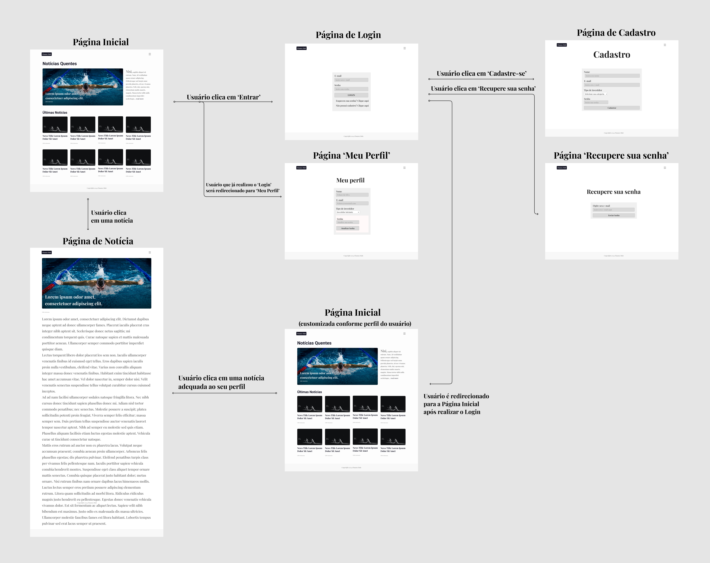

 User Flow do Projeto FinanceHub

## Wireframes

Representações visuais da estrutura do projeto FinanceHub, essenciais para delinear a experiência do usuário e planejamento da arquitetura e navegação do projeto.

A seguir, serão apresentadas as páginas, em suas versões desktop e mobile, demonstrando também o compromisso em oferecer responsividade para o projeto, e suas respectivas descrições de wireframe.

 ### Página Inicial
Página inicial do projeto FinanceHub, cujo objetivo é disponibilizar uma seleção de notícias. 
Quando o usuário realizar o login, esta mesma seleção será filtrada e adequada ao seu perfil de investidor.

  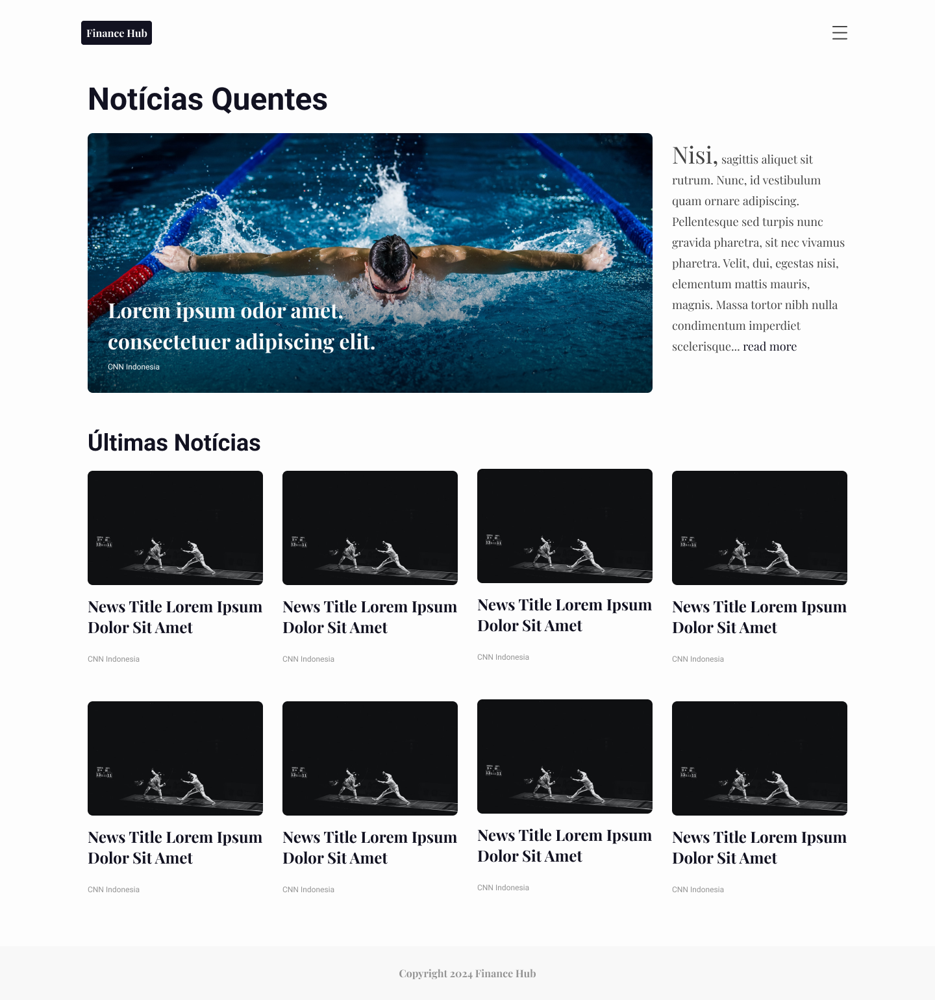
  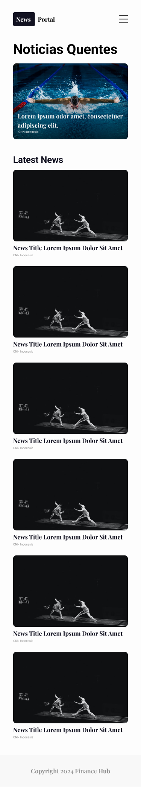 

 ### Página de Login
Página de login, que possui as funcionalidades de permitir que os usuários realizem o login em suas contas, ou serem redirecionados para as páginas de 'Cadastro de Usuário' ou 'Recupere a sua senha'

 

  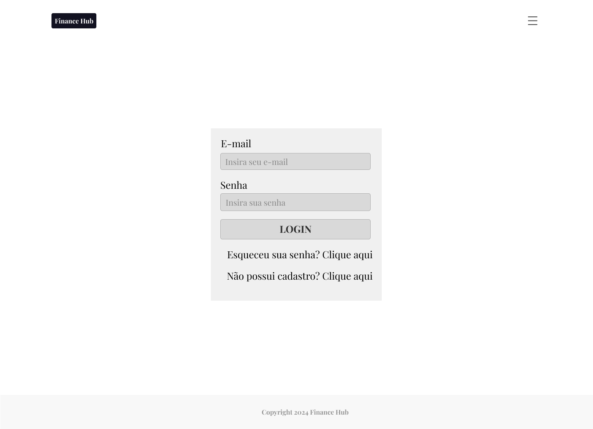
  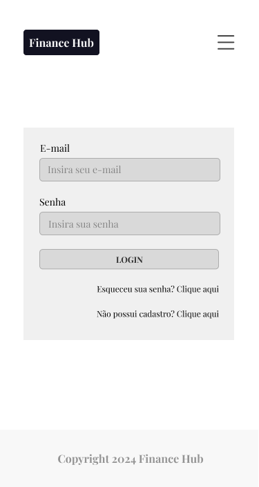 

 ### Página de Cadastro de Usuário
Página de cadastro de usuário, cuja funcionalidade é permitir que o usuário cadastre uma conta para poder acessar a funcionalidade de filtro de notícias.

 

  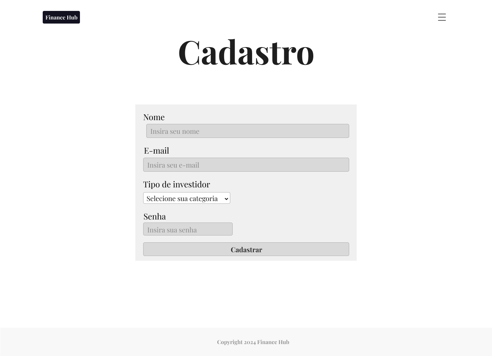
  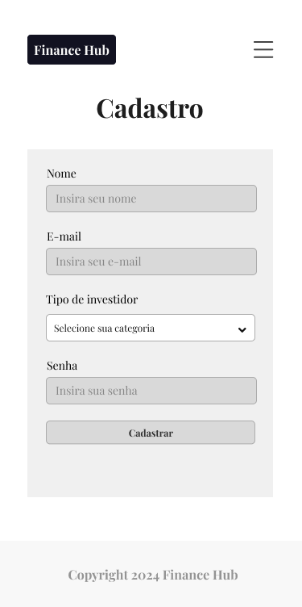 

 
  ### Página de Recupere sua senha
Página que permite ao usuário cadastrado recuperar a sua senha, que por ventura foi perdida.

 

  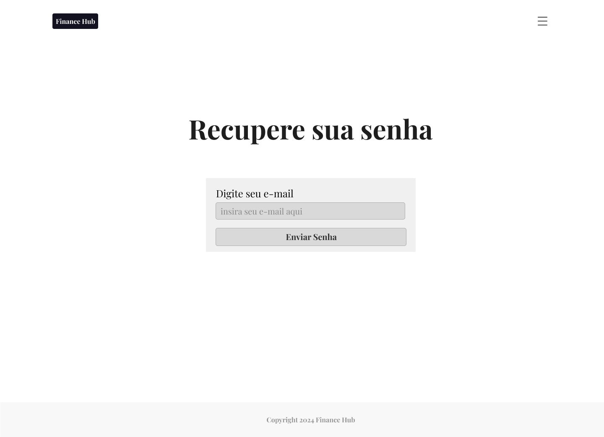
  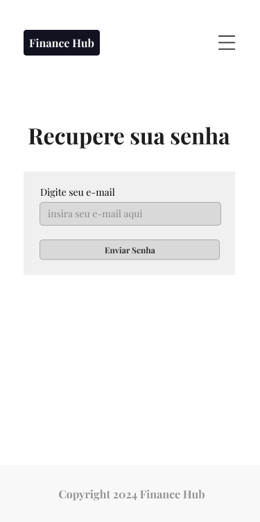 

  ### Página de Meu Perfil
Página que disponibiliza as informações as informações do usuário que realizou o login, e a funcionalidade de alterá-las.
	
 

  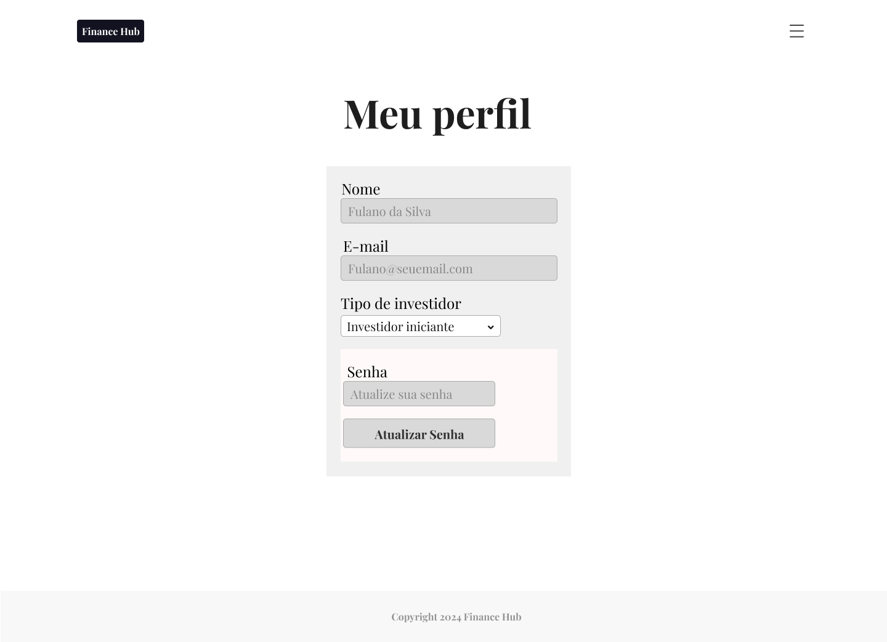
  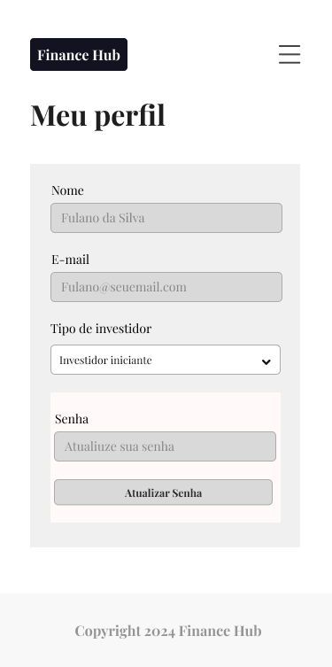 

 
  ### Páginas de Notícias
Páginas que contém as informações completas, desejadas pelo usuário, acessadas através da Página Inicial.
	
 

  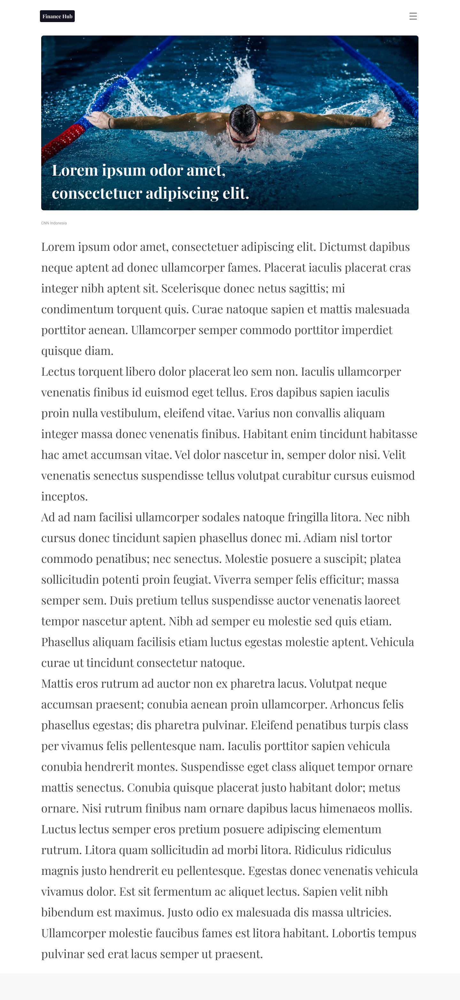
   

 
