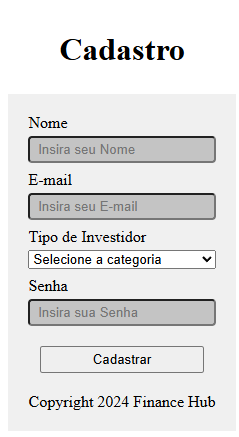
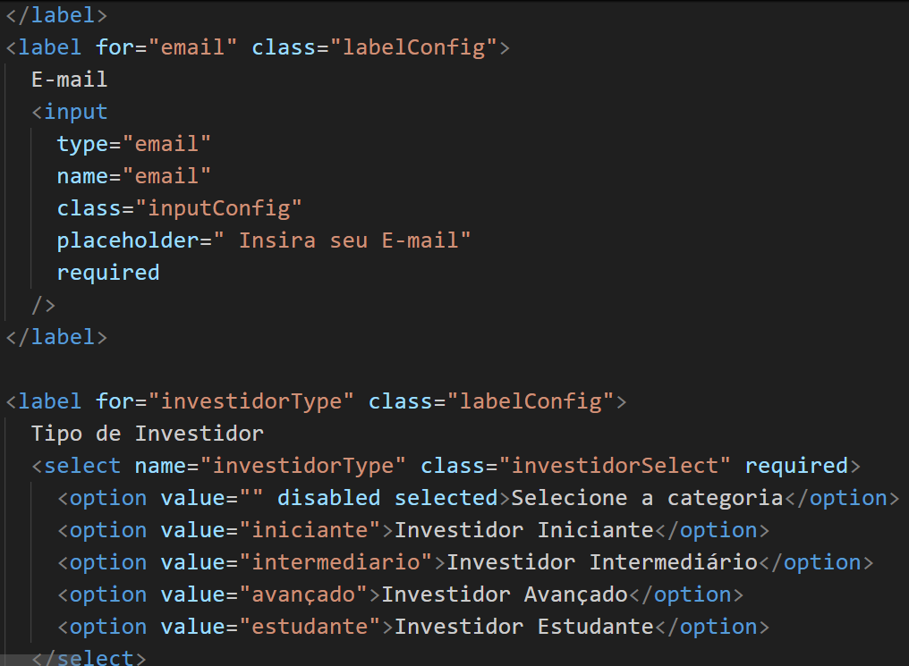
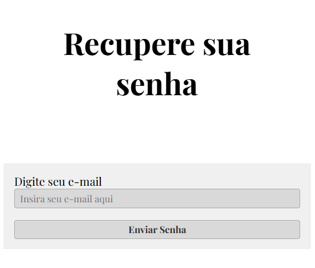
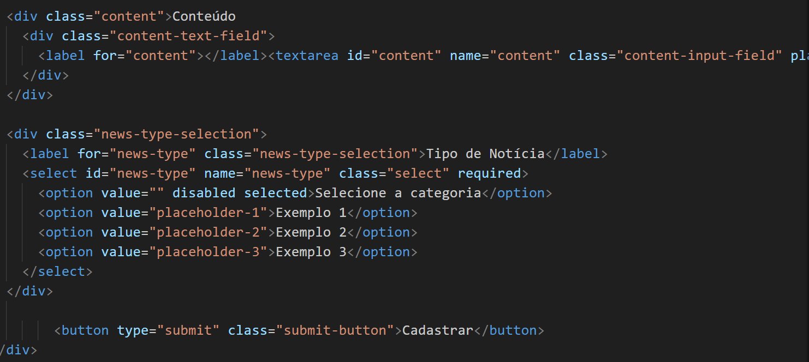
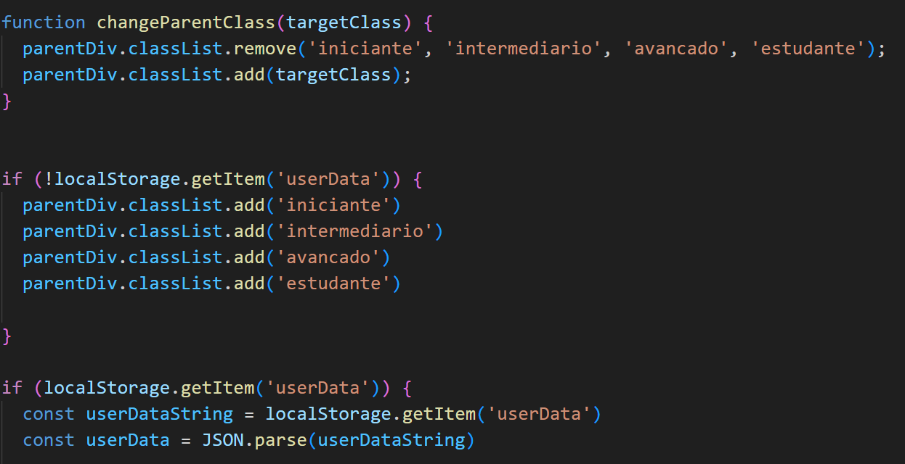

# Cadastro de Novo Usuário

**Requisito**

• RF-001 - O sistema permitirá cadastro de novos usuários, com nome, senha, e-mail e tipo de investidor.

Para atender ao requisito RF-001 foi desenvolvido a página de Cadastro com a seguinte estrutura.

Serão exibidos cinco campos, Insira seu Nome/Insira seu E-mail/Selecionar Tipo de Investidor/Insira sua Senha. O button do tipo submit - Cadastrar - e de classe botao é para o usuário concluir o cadastro no site.

Os dados são registrados no localStorage do navegador de acordo com a estrutura de dados.

## Recuperação de Senha

**Requisito**

• RF-002 - O sistema permitirá efetuar a troca de senha do usuário

Para atender ao requisito RF-002 foi desenvolvido a página Recupere sua senha com a seguinte estrutura.

Serão exibidos dois campos: Insira  seu E-mail aqui e button do tipo submit - Enviar Senha - e de classe botao é para o usuário concluir a troca de senha no site.

Os dados são registrados no localStorage do navegador de acordo com a estrutura de dados.

## Cadastro de Notícias

**Requisito**

• RF-003 - Cadastro de notícias, Análises financeiras, Relatórios e Balancetes

Para atender ao requisito RF-003 foi desenvolvido a página de Cadastro de Notícias com a seguinte estrutura.

Serão exibidos cinco campos: Insira o Título da Notícia/ Insira a Fonte da Notícia/ Insira o conteúdo da Notícia/ Selecionar o Tipo de Notícia e um button do tipo submit - Cadastrar - e de classe botao é para o usuário concluir o cadastro de notícia no site.

Os dados são registrados no localStorage do navegador de acordo com a estrutura de dados.

## Cadastro de Tipo de Usuários

**Requisito**

• RF-004 - Cadastro de Tipos de Usuários/Investidores

Para atender ao requisito RF-004 foi desenvolvido a página de Cadastro de Tipo de Investidor com a seguinte estrutura.

Serão exibidos três campos: Insira o Nome do Tipo de Investidor/ Insira uma breve descrição e um button do tipo submit - Cadastrar - e de classe botao é para o usuário concluir o cadastro de tipo de investidor no site.

Os dados são registrados no localStorage do navegador de acordo com a estrutura de dados.

## List de Notícias e Asset de Notícias

**Requisito**

• RF-005 - List de notícias, análises financeiras, relatórios e Balancetes com filtro do usuário
• RF-006 -  Asset de notícias, análises financeiras, relatórios e balancetes

Para atender aos requisitos RF-005 e RF-006 foi desenvolvido um List com diversas Notícias com a seguinte estrutura.

Serão exibidas diversas notícias de acordo com o cadastro efetuado.

## Responsividade

**Requisito**

• RN-001 -  Aplicação responsiva para rodar em celulares, tablets, e desktops.

Para atender ao requisito RN-001 implementado no Código CSS de cada página códigos para deixá-los responsivos.

## Programação

**Requisito**

• RN-002 - O sistema dever ser utilizando utilizando HTML, CSS e JavaScript

Para atender ao requisito RN-002 o projeto foi inteiramente programado em HTML, CSS e JavaScript.

## LocalStorage

**Requisito**

• RN-003 - Ao utlizar a aplicação os dados devem ser salvos em localStorage

Para atender ao requisito RN-003 o projeto foi programado, de acordo com o arquivo script.js de forma a todos os dados utilizados e cadastrados no website serem salvos em LocalStorage

